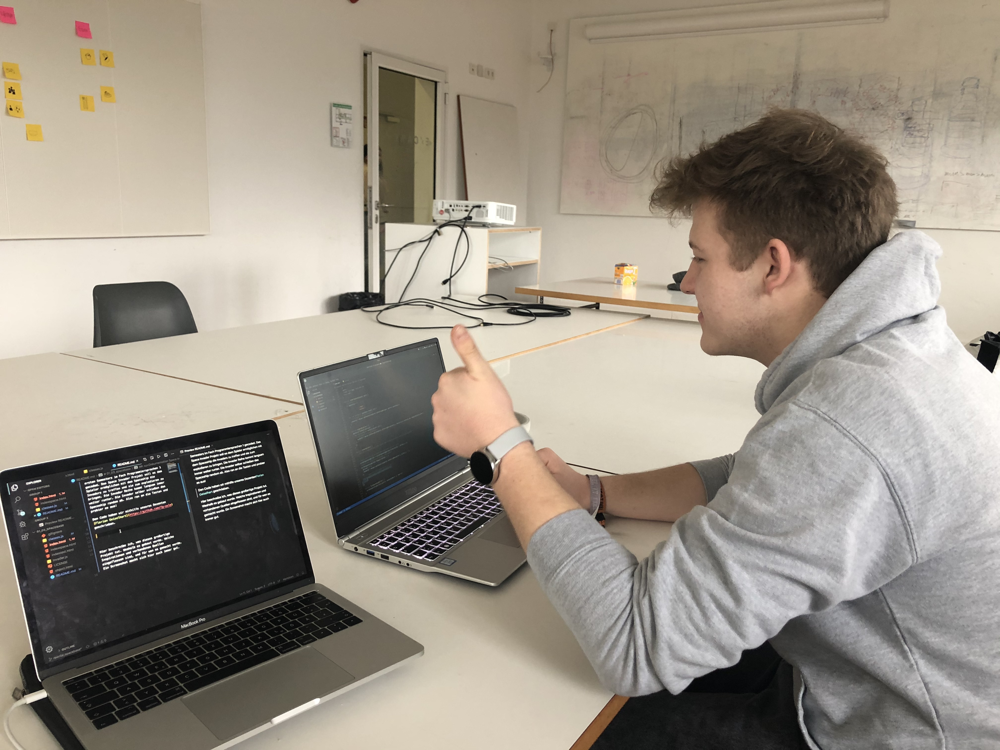

# 01_03_spacebase

## <u>Dokumentation Space Invader</u>
##### Maximilian Becht und Tara Monheim
>Maximilian Becht auf [Github](https://github.com/maxicozy).

>Tara Monheim auf [Github](https://github.com/taramonheim).

Unser Space Invader Projekt wurde im Laufe des ersten Semesters im Fach Programmiersprachen 1 gecoded. Das Space Invader
Projekt soll es dem Spieler ermöglichen mit dem Spaceship die Invaders zu treffen und sie zum explodieren zu bringen.
Die Invader Reihe kommt langsam immer weiter runter. Also ran an die Tasten und probier es aus!

Den Code haben wir mithilfe unseres Dozenten[ Florian Geiselhart](https://github.com/fg-uulm) (das bist du)
geschrieben. Er basiert auf dem Basis Code von unserem Dozenten und wurde von uns erweitert. Den Basis Code findet man
[hier](https://github.com/hfgcoding/01_03_spacebase).
Auch das Internet hilft in der Regel, aber da es sehr viele Space Invader Games gibt, die programmiert wurden,verliert
man schnell den Überblick.
Also ransetzen, denken und coden! Was immer hilft:
Die Klassen und Eigenschaften einfach mal aufzuschreiben. Mit Papier und Stift. Ganz Old School.

Eigenschaften des Spiels, an denen wir gearbeitet haben:

1. Die Invader werden radom gerendert.

2. Die Invader werden in einer Reihe generiert.
3. Es werden so viele Invader generiert, wie in das Feld passen.
4. Wenn die Invader Reihe an den Rand des Felds kommt bewegt sie sich eine Zeile runter und in die andere Richtung.
5. Das Spaceship schießt auf die Invader, trifft ein Bullet den Invader, explodiert dieser.
6. Ein Score am Rand zählt hoch, wenn man einen Invader trifft.
7. Unser Code baut auf Klassen auf, die wir in der Javascript Datei definiert haben.

## Usage / Benutzung

Um das Spiel selbst zu erleben, kann man den Code entweder einfach von Github downloaden und in einen Code Editor
öffnen, um ihn zu individualisieren oder man öffnet ihn mit einem Browser.
Im Code Editor braucht man
die [classes.js](classes.js) und die [index.html](index.html), die auf Github zu finden sind.
Um das ganze in einem belibiegen Browser öffnen zu können, muss man das Repository auf Github forken und clonen und dann
die Html Datei mit einem Browser öffnen.
Sobald die Seite geladen ist startet auch das Spiel. Die Invader bewegen sich in ihrer Reihe von links nach rechts,
treffen sie an den Rand, rücken sie eine Zeile nach unten und ändern ihre BEwegungsrichtung nun nach links.Das Spaceship
kann man mit den <kbd>key left</kbd> und <kbd>key right</kbd> Tasten bewegen. Durch die
<kbd>Leertaste</kbd> schießt das Spaceship auf die Invader. Diese explodieren, sobald sie getroffen werden. Durch die
Barriere, die das Spaceship schützen soll, kann man nicht durchschießen.
Die Invaders selber können zur Zeit noch nicht auf das Spaceship schießen.
Würde das funktionieren, müsste auch die Barriere, bei Abschuss derer, Stück für Stück verschwinden.
Durch den Reload Button des Fensters kann man das Spiel neu starten.

## Structure / Aufbau

Wir haben das Spiel anhand von Klassen aufgebaut,
deren Eigenschaften wir in der Javascript Datei angegeben haben. In der Html Datei greifen wir auf diese Klassen zu.

* **Invader**: Hier ruft die Klasse Invader durch den constructor ihre `Appaerance` und `id` auf.

<pre>class Invader {
  constructor(appearance, id) {
    this.appearance = appearance;
    this.id = id;
  } </pre>

* **Invader Row** Eine Klasse, die die Invader in einer Reihe generiert. Mit den Eigenschaften Position der Reihe, der
Breite und Höhe, zudem greift sie auf unsere erzeugten invaders zu und hat selber eine id.

<pre>class InvaderRow {
  constructor(posX, posY, width, height, invaders, id) {
    this.id = id;
    this.posX = posX;
    this.posY = posY; 
    this.width = width;
    this.height = height;
    this.invaders = invaders;
  } 
  //hier werden noch die beiden static Variablen eingefügt
  </pre>

* **static generateInvader** Eine Variable, um den Invader in Code abzubilden. Enthält typische Eigenschaften des
Invaders:

>Mit Static deklariert man solche Variablen, die bei jedem Objekt einer Klasse gleich sein sollen und sobald die
Variable in einem der Objekte verändert wurden, auch bei allen anderen Objekten der Klasse verändert werden

<pre> static generateInvader(width, height) {
    let currentInvader = [];
    for (let y = 0; y < height; y++) {
      currentInvader[y] = " ".repeat(width*2+1);
      for (let x = 0; x < width; x++) {
        let randomNumber = Math.random();
        if (randomNumber >= 0.5) {
          currentInvader[y] = (Helper.setCharsAt(currentInvader[y], x,'#'));
          currentInvader[y] = (Helper.setCharsAt(currentInvader[y], 2 * width - x,'#'));
        }
      }
    }
    return currentInvader;
  }
  </pre>

* `width, height`: Invadergröße (Property)
* `currentInvader`: Hier wird der current Invader generiert.
- eine zufällige Zahl wird generiert ist diese größer oder gleich 0.5, so wird ein "#" an diese Stelle des
currentInvaders Arrays geschrieben. Somit hat man die Hälfte diesens und sie wird gespiegelt.

* **static generateInvaderRow:** Eine Variable um eine Person in Code abzubilden. Enthält typische Eigenschaften und
Methoden von Menschen, um mit Bier zu interagieren:
<pre> static generateInvaderRow(invaderWidth, invaderHeight) {
    let currentInvaders = [];
    let rowWidth = Math.floor(cols*0.8);
    let wholeInvader = invaderWidth * 2;
    let spacerWidth = invaderWidth/2; 
    let numInvaders = Math.floor((rowWidth / ((wholeInvader+spacerWidth))));
    let invaderAppearance = InvaderRow.generateInvader(invaderWidth, invaderHeight);
    //let numInvaders = Math.floor(spacing);
			for(let i = 0; i < numInvaders ; i++) { // gerundet(x = ((breite - breite*0,2) / invaderbreite) + (x - 1) * invaderbreite/2 ))
        let newInv = new Invader(invaderAppearance, i);
        currentInvaders.push(newInv);
			}
		return currentInvaders;
  } </pre>

Hier rechnen wir aus wie viele Invaders in einer Reihe gerendert werden können.

## Zusammenfassung

* `drinkBeer(beer)`: trinkt ein Bier, welches als Parameter übergeben wird und vom Typ / Klasse "Beer" sein muss
(Funktion)
* `isDrunk`: gibt an ob eine Person betrunken ist (Property, Boolean)

_Zentrale Funktionen (die nicht zu Klassen gehören) folgen dem selben Muster, werden aber meist etwas ausführlicher
beschrieben:_

`haveParty(persons[], interval)`: Eine Funktion die ein Array von Personen entgegennimmt, und diese dann im angegebenen
Intervall Bier trinken lässt. Nach jedem Durchlauf durch das Biertrinken (durch Aufruf von drinkBeer mit einem neu
erzeugten Bier-Objekt) wird überprüft, ob die Anzahl der betrunkenen Personen größer 0 ist. Wenn dies eintritt, wird das
Intervall bei jedem Durchlauf auf die doppelte Länge verlängert. Die Funktion endet in ihrer Ausführung dann wenn alle
Personen isDrunk = true zurückgeben, oder wenn das Interval größer als 1 Stunde wird. Wird die Funktion mit nur einer
Person im Array aufgerufen, wird eine Warnmeldung ausgegeben, um versehentliches Trinken alleine zu vermeiden.

_(Achtung: Hier werden nur Funktionen beschrieben, die eine zentrale Rolle einnehmen.)_

Nach der Beschreibung der elementaren Bestandteile wird aus der Vogelperspektive nochmals beschrieben, welche
Gesamtzustände euer System durchlaufen kann. In diesem Fall würde der User zunächst 0 bis n Personen erzeugen, und diese
mit haveParty() zum Bier trinken bringen. Dabei wird innerhalb von haveParty nacheinander für jede Person drinkBeer()
aufgerufen, unter Benutzung von neuen Bier-Objekten. Nach Ende der Party muss das Programm neu gestartet werden um die
Zustände zurückzusetzen.

_(Achtung, dieser Teil liest sich jetzt sehr ähnlich zur Funktionsbeschreibung von haveParty - das liegt daran dass es
im Beispiel nur eine zentrale Funktion gibt. Ihr habt aber mehrere die zusammenspielen!)._