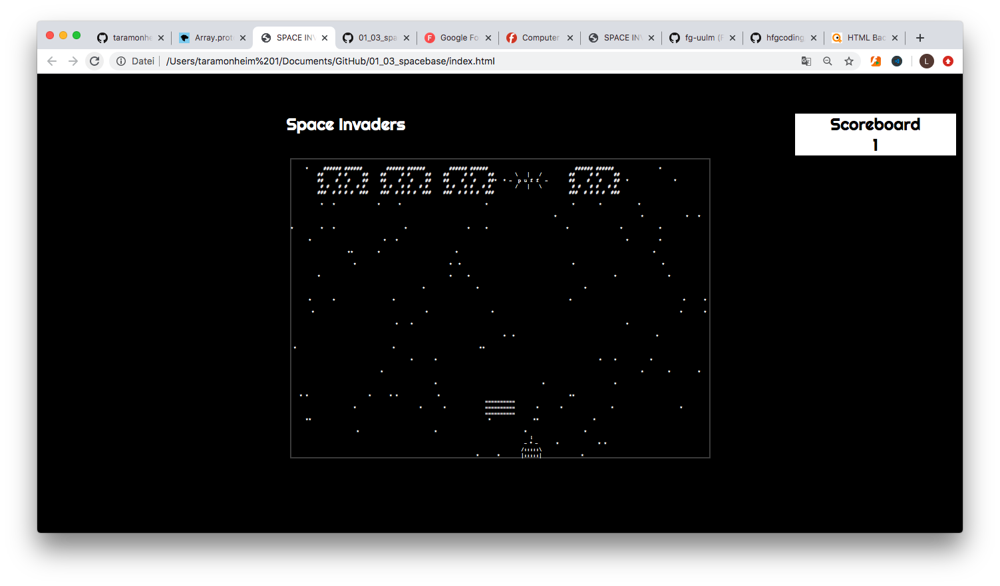

# <b>Dokumentation Space Invader Projekt/ 01_03_spacebase</b>
##### Maximilian Becht und Tara Monheim
>Maximilian Becht auf [Github](https://github.com/maxicozy).

>Tara Monheim auf [Github](https://github.com/taramonheim).

Unser Space Invader Projekt wurde im Laufe des ersten Semesters im Fach Programmiersprachen 1 gecoded. Das Space Invader Projekt soll es dem Spieler ermöglichen mit dem Spaceship die Invaders zu treffen und sie zum Explodieren zu bringen.
Die Invader Reihe kommt langsam immer weiter runter. Also ran an die Tasten und probier unser Spiel aus!

Den Code haben wir mithilfe unseres Dozenten[ Florian Geiselhart](https://github.com/fg-uulm)
geschrieben. Er basiert auf dem Basis Code von unserem Dozenten und wurde von uns erweitert. Den Basis Code findet man [hier](https://github.com/hfgcoding/01_03_spacebase).
Auch das Internet hilft in der Regel, aber da es sehr viele Space Invader Games gibt, die programmiert wurden, verliert man schnell den Überblick.
Also ransetzen, denken und coden! Was auch immer hilft:
Die Klassen und Eigenschaften einfach mal aufzuschreiben. Mit Papier und Stift. Ganz Old School.

## Eigenschaften des Spiels, an denen wir gearbeitet haben:

1. Die Invader werden radom gerendert.

2. Die Invader werden in einer Reihe generiert.
3. Es werden so viele Invader generiert, wie in das Feld passen.
4. Wenn die Invader Reihe an den Rand des Spielfelds kommt bewegt sie sich eine Zeile runter und in die andere Richtung.
5. Das Spaceship schießt auf die Invader, trifft ein Bullet den Invader, explodiert dieser.
6. Die Explosion wird mit einer induvidualisierten Animation gezeigt. 
7. Das Scoreboard am Rand zählt hoch, wenn man einen Invader trifft.
8. Wir haben eine Grundstruktur mit Klassen geschaffen, auf der der Code aufbaut. 

## Wer wir sind: 

# Usage / Benutzung

Um das Spiel selbst zu erleben, kann man den Code entweder einfach von Github downloaden und in einen Code Editor
öffnen, um ihn zu individualisieren oder man öffnet ihn mit einem Browser.
Im Code Editor braucht man
die [classes.js](classes.js) und die [index.html](index.html), die auf Github zu finden sind.
Um das ganze in einem beliebigen Browser öffnen zu können, muss man das Repository auf Github forken und clonen und dann
die Html Datei mit einem gewünschten Browser öffnen.
Sobald die Seite geladen ist startet auch das Spiel. Die Invader bewegen sich in ihrer Reihe von links nach rechts,
treffen sie an den Rand, rücken sie eine Zeile nach unten und ändern ihre Bewegungsrichtung nun nach links. Das Spaceship
kann man mit den <kbd>key left</kbd> und <kbd>key right</kbd> Tasten bewegen. Durch die
<kbd>Leertaste</kbd> schießt das Spaceship auf die Invader. Diese explodieren, sobald sie getroffen werden. Durch die
Barriere, die das Spaceship schützen soll, kann man nicht durchschießen.
Die Invaders selber können zur Zeit noch nicht auf das Spaceship schießen.
Würde das funktionieren, müsste auch die Barriere, bei Abschuss derer, Stück für Stück verschwinden.
Durch den Reload Button des Fensters kann man das Spiel neu starten. 

# Structure / Aufbau

Wir haben das Spiel anhand von Klassen aufgebaut,
deren Eigenschaften wir in der Javascript Datei angegeben haben. In der Html Datei greifen wir auf diese Klassen zu.

### **class Invader**:

<pre>
class Invader {
  constructor(appearance, ischBinKaputt, explodeTime, id) {
    this.appearance = appearance;
    this.id = id;
    this.ischBinKaputt = ischBinKaputt;
    this.explodeTime = explodeTime;
  }
  shootLaser() {
    console.log("Invader " + this.id + " Laser shot")
  }
  explode() { 
    this.appearance = ["                ",
      "   \\   |   /    ",
      " -  p u f f  -  ",
      "   /   |   \\    ",
      "                "
    ];
  }
}
 </pre>

* hier haben wir der Klasse Invader die Eigenschaften `appearance`, `ischBinKaputt`, `explodeTime` und `id` zugeorndet.
Außerdem haben wir ihm die Methode `explode()` gegeben,um sein Aussehen nach dem Explodieren zu bestimmen.

### **class InvaderRow**
<pre>
class InvaderRow {
  constructor(posX, posY, width, height, invaders, id) {
    this.id = id; 
    this.posX = posX;
    this.posY = posY;
    this.width = width;
    this.height = height;
    this.invaders = invaders;
  }
    step(direction) {
    if (direction == 1) {
      this.posX += 1;
    }
    if (direction == -1) {
      this.posX -=1;
    }
    if (direction == "down") {
      this.posY += 1;
    }
  }
  </pre>

* Die Klasse `InvaderRow` beinhaltet ihre eigene Position und invader.

### Desweiteren beinhaltet die Klasse `InvaderRow` die folgenden Methoden:

### **static generateInvader:**

>Das <kbd>static</kbd> Schüsselwort definiert statische Methoden für eine Klasse.

<pre> static generateInvader(width, height) {
    let currentInvader = [];
    for (let y = 0; y < height; y++) {
      currentInvader[y] = " ".repeat(width * 2 + 1); 
      for (let x = 0; x < width; x++) {
        let randomNumber = Math.random();
        if (randomNumber >= 0.5) {  
          currentInvader[y] = (Helper.setCharsAt(currentInvader[y], x, '#'));
          currentInvader[y] = (Helper.setCharsAt(currentInvader[y], 2 * width - x, '#'));
        }
      }
    }
    return currentInvader;
  }
  </pre>

* `width, height`: Invadergröße (Property)
* `currentInvader`: ist ein Array, in das so viele Strings generiert werden, wie der Invader hoch ist
* eine zufällige Zahl wird generiert ist diese größer oder gleich `0.5`, so wird ein `"#"` an diese Stelle des
currentInvaders Arrays geschrieben. Somit hat man die Hälfte dieses Invaders. Diese wird anschließend gespiegelt.

### **static generateInvaderRow:**

<pre>  static generateInvaderRow(invaderWidth, invaderHeight) {
    let currentInvaders = [];
    let rowWidth = Math.floor(cols * 0.8); 
    let wholeInvader = invaderWidth * 2; 
    let spacerWidth = invaderWidth / 2; 
    let numInvaders = Math.floor((rowWidth / ((wholeInvader + spacerWidth)))); 
    let invaderAppearance = InvaderRow.generateInvader(invaderWidth, invaderHeight); 
    for (let i = 0; i < numInvaders; i++) { 
      let newInv = new Invader(invaderAppearance, false, 0, i); 
      currentInvaders.push(newInv);
    }
    return currentInvaders;
  }
}</pre>

* hier wird ausgerechnet wie viele Invader in 80 % der Spielfeldbreite passen. Anschließend werden so viele Invader in ein Array gepusht.

### function renderInvaderrow

<pre>
function renderInvaderRow(invaders) {
  let currentInvXPos = invaders[rowId].posX;
  for (let j = 0; j < invaders[rowId].invaders.length; j++) {
    for (let i = 0; i < invaders[rowId].invaders[j].appearance.length; i++) {
      renderStr = Helper.setCharsAt(renderStr,xyToStringPos(invaders[rowId].invaders[j].id + currentInvXPos, invaders[rowId].posY+i), invaders[rowId].invaders[j].appearance[i]);		
		}
    currentInvXPos = currentInvXPos + invaderWidth* 2 + invaderWidth/2;
		}
	}</pre>

* Diese Funktion läuft durch die aktuelle Invaderrow und deren Invader und schreibt diese anschließend in den RenderString. 

### function renderBullets

<pre>	
function renderBullets() {
  currentSpaceshipBullets = currentSpaceshipBullets.filter(bullet => bullet.y > 1);
  currentSpaceshipBullets.forEach((bullet) => {
    bullet.y -= 1;
    if (renderStr[xyToStringPos(bullet.x, bullet.y - 1)] == '#') {
      let currentId = 0;
      for (let invaderPos = invaders[rowId].posX; invaderPos <= invaders[rowId].posX + (invaderWidth * 2 + invaderWidth / 2); invaderPos = invaderPos + invaderWidth * 2 + invaderWidth / 2) {
        if (bullet.x > invaderPos && bullet.x < invaderPos + invaderWidth * 2) { 
          invaders[rowId].invaders[currentId].ischBinKaputt = true; 
          invaders[rowId].invaders[currentId].explode();
          invaderPoints++; 
          break; 
        }   
      currentId++;
      }
    currentSpaceshipBullets = currentSpaceshipBullets.filter(currentBullet => currentBullet != bullet);
    }
    if (renderStr[xyToStringPos(bullet.x, bullet.y - 1)] == '=') {
      currentSpaceshipBullets = currentSpaceshipBullets.filter(currentBullet => currentBullet != bullet};
    }
    renderStr = Helper.setCharsAt(renderStr, xyToStringPos(bullet.x, bullet.y), "|");
  })
}
</pre>

*   Ein Großteil dieser Funktion wurde von unserem Dozenten gecoded. Wir haben hier die Funktion hinzugefügt, die prüft, ob die Bullet den Invader trifft. Das funktioniert über einen Abgleich, ob sich im Feld über der Bullet ein Hashtag befindet, also der Character aus dem ein Invader besteht.
Wenn dies der Fall ist, wird nun abhängig von der aktuellen Anfangsposition der Invaderreihe ausgerechnet an welchem Invader sich die Bullet befindet, dann führt der getroffene Invader die Methode
`explode()` aus, ausserdem wird eine Variable mit jedem Treffer um eins hochgezählt.
Zusätzlich wird die aktuell gerenderte Bullet aus dem `currentSpaceshipBullets` Array herausgefiltert, falls diese einen Invader getroffen hat.

* Das gleiche Prinzip haben wir für die Obstacles übernommen: die aktuell gerenderte Bullet checkt auch, ob sich über ihr ein `=` befindet. In diesem Fall wird die Bullet gelöscht. 

## Zusammenfassung

### Abläufe:

* <i> die Invaderreihe wird generiert und bewegt sich dann</i>:

  * In der `newGame()` Funktion wird ein neues Objekt der Klasse InvaderRow erstellt. Dieses generiert sich selbst ein Array aus Objekten, die Alle jeweils einen Invader enthalten. Ausserdem erhält jeder Invader, sowie die Reihe selbst eine Id. Die Menge an Invadern, die in einer InvaderRow generiert wird, wird in Abhängigkeit von Spielfeldbreite und Invaderbreite ausgerechnet.
  * Die Methode `renderInvaders()` läuft durch alle Invader der aktuellen InvaderRow und schreibt diese nacheinander in den RenderString. Die Position des ersten Invaders ist in der InvaderRow gespeichert, die anderen Positionen werden durch das aufaddieren des Abstandes ermittelt.
  * In der `render()` Funktion wird nach Verstreichen einer über die gameSpeed definierten Zeit ein Ablauf ausgelöst, der die Methode `step(direction)` aufruft, die direction hängt dabei von der aktuellen Richtung ab, in die sich die Invader bewegen und davon ob sich die Invaderreihe aktuell an einer Wand befindet.

* <i>ein Invader wird abgeschossen</i>:

  * die `renderBullets()` Methode fragt bei jedem Render einer Bullet ab, ob sich über ihr ein Invaderpixel befindet. In diesem Fall löst der getroffene Invader die Methode `explode()` aus. Zudem wird die Variable `ischBinKaputt` auf `true` gesetzt, damit die `render()` Funktion den `explodeTime` Timer des Invaders iniziieren kann und so der explodierte Invader nach einer Zeit verschwindet.
  Parallel zählt bei einem Treffer die Variable `killedInvaderCount/ invaderPoints` hoch, diese wird in einem Scoreboard in der Html Datei angezeigt.

## ToDos

1. in einem weiteren Shcritt könnte man  die Invaders selber schießen lassen. Dies sollte random passieren.  

2. Es können mehrere Reihen von Invaders aufeinander folgen.
3. Das Hindernis muss bei Abschuss der Invader kaputt gehen.
4. Wenn die Invader eine gewissen Punkt auf der y-Achse erreichen, sollte der Spieler verloren haben.
5. Man kann noch eine Game Over/ Win Schrift einbauen.
6. Wenn die Invader getroffen werden, erhöhen sie auch die Geschwindigkeit, damit es schwieriger wird sie Abzuschießen.
7. Einen New Game Button, um das Spiel mit dem Button neu zu starten.
8. Das Spaceship hat mehrere Leben und eine Lebensanzeige, die bei Treffer durch Invader weniger werden.
9. Ein Invader Boss, der auftaucht und mehr Punkte bringt.
10. Hintergrundmusik und Soundeffekte
13. Verschiedene Level mit unterschiedlichen Schwierigkeitsstufen.

